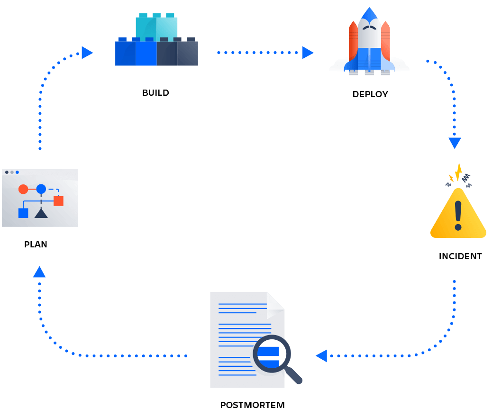

# 0x19. Postmortem
### `DevOps` `SysAdmin`

### Issue Summary:

- Duration of the outage: 20 min , from 18:05 to 18:25 (UTC)

- Impact: The service affected was a platform, which experienced slow response times, and 20% of our users encountered errors and delays.

Root Cause:

- The root cause of the issue was a sudden spike in traffic.

### Timeline:

- 18:05 (UTC): Issue detected when monitoring alerts signaled a significant increase in response times.

- Actions Taken: The operations team investigated potential causes, initially suspecting a database bottleneck.

- Misleading Investigation: The initial focus on the database led to unnecessary optimization efforts.

- Escalation: After an hour of investigation, the incident was escalated to the development team.

- 18:15 (UTC): The development team identified that the issue was not database-related and pointed to the web servers.

- Actions Taken: The web servers were analyzed, revealing a high number of incoming requests.

- 18:20 (UTC): The team increased the server capacity to handle the increased traffic.

- 18:25 (UTC): The service was fully restored, and traffic returned to normal.

**Root Cause and Resolution:**

- Root Cause: The unexpected surge in traffic, causing the web servers to become overloaded.

- Resolution: Increasing server capacity helped handle the traffic, but long-term solutions were discussed.

**Corrective and Preventative Measures:**

- Improve server scaling strategies for sudden traffic spikes.

- Implement automated load balancing to distribute traffic efficiently.

- Add more extensive monitoring for web server performance.

- Update the incident response plan to involve development teams earlier in such incidents.

**Tasks to Address the Issue:**

1. Review and optimize server scaling strategies.

2. Implement automated load balancing for web servers.

3. Enhance monitoring with real-time traffic analysis.

4. Update incident response procedures to involve relevant teams promptly.

This postmortem outlines the issue's impact, root cause, timeline of events, and corrective/preventative measures. It emphasizes the need for better scalability and automation in handling traffic spikes and more effective collaboration between teams during incidents.